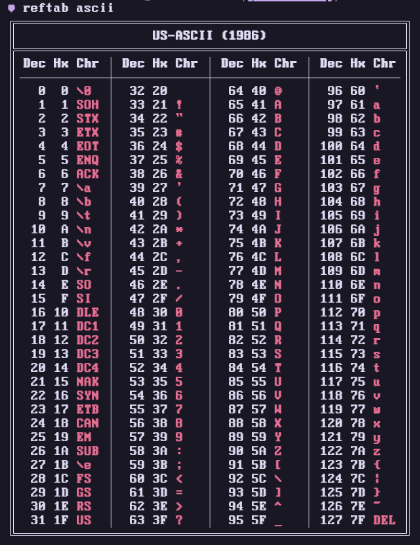

# Reftab - Reference Tables / Cheat Sheets designed for My Brain In Particular <3
## Table of Contents
- [The Pitch](#the-pitch)
- [TL;DR](#the-tldr)
- [The Motivation](#the-motivation)
- [The Goal](#the-goal)
- [Available Tables](#available-tables)
- [Alternatives](#alternatives)

## The Pitch
Are you sick of searching "ASCII Table" every time you want to remember that the alphabet starts at `0x41`?
Do you want a handy reference to [Code Page 437](https://en.wikipedia.org/wiki/Code_page_437) for your [Dwarf Fortress](https://www.bay12games.com/dwarves/) clone?

Are you just, really tired of leaving the console for things that should be right in front of your face?

## The TL;DR
`reftab` is a CLI tool for displaying Reference Tables containing arbitrary data, e.g. Character Sets, Keyboard Shortcuts, Syntax Hints, and more!

<!--
You install it like this:
```bash
pip install reftab
```
-->
## It works like this:



It's that simple!

## The Motivation
For some reason, I find myself in need of very specific data a very strange amount of the time. Eventually it became too frustrating to navigate to the same few online resources over and over, often for only a few seconds while I got the information I needed, so I decided to create a solution that worked better for my needs. If it's helpful for you too, that's even better :)

## The Goal
Every table in `reftab` should...

:mag: be easy to locate
- If you don't know where it is, you should know how to find it.

:nail_care: present information clearly, succinctly, and beautifully
- Every table should be guaranteed to fit within 80 columns

:shushing_face: not lie
- Information should be accurate (this should go without saying but hey now people REALLY get to yell at me if there's errors)

:zap: arrive fast, leave faster
- Every table should load within one second

In other words, basically the opposite of this README :sunglasses:

## Available Tables
Want a table that's not on here? Consider [creating an issue](https://github.com/Pyroan/reftab/issues/new?labels=table+request&title=New+table+request&body="Please+provide+a+reference+to+the+data+you+would+like+included.") to request it!

|            |
|------------|
| CSS Colors |
| IBM 437    |
| US-ASCII   |

## Alternatives
- `man ascii` (only includes `US-ASCII`, naturally)
- the Internet in general